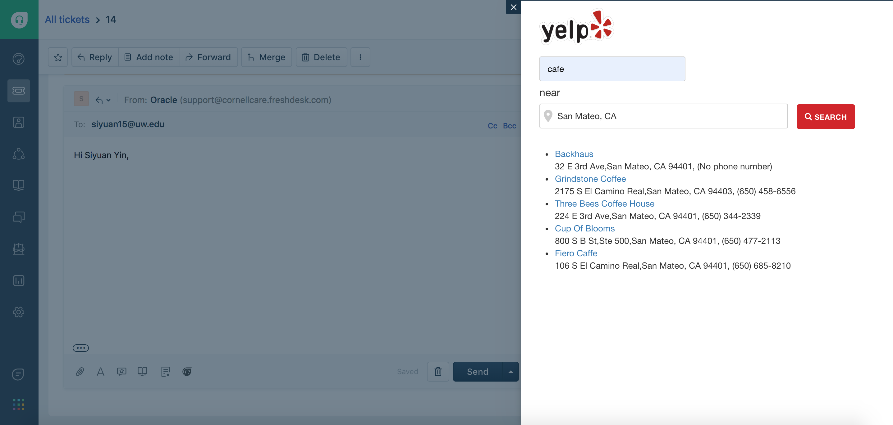
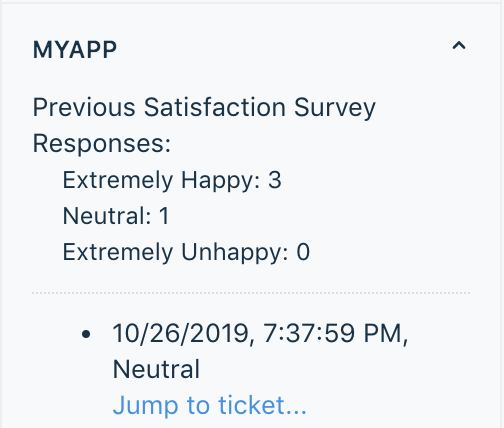

## Gimmefood Customized App

There are two apps designed for Gimmefood use-cases.

App 1: Yelp Search

This apps makes Yelp search in Freshdesk platform. It takes user input and search
for matching listing on Yelp using Yelp Fusion API.

This app demonstrates the following features

1. Request API - GET

App 2: Display Satisfaction Response

This app displays all previous satisfaction survey response for each customer.

This app demonstrates the following features

1. Request API - GET
2. Data API - retrieve ticket requester information
3. Interface API - navigate to ticket details
